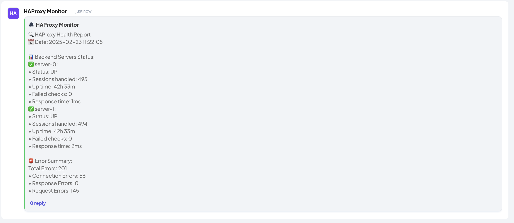

# HAProxy Monitor

An integration for monitoring HAProxy statistics through Telex webhooks. This service collects HAProxy metrics and sends formatted reports to specified Telex channels at configured intervals.

## Features

- Real-time HAProxy statistics monitoring
- Customizable monitoring intervals
- Detailed health reports including:
  - Backend server status
  - Session statistics
  - Error tracking and breakdown
  - Response time metrics
- Secure authentication support
- Webhook integration with Telex

## Prerequisites

- Python 3.8+
- HAProxy instance with stats endpoint enabled
- Telex webhook URL

## Installation

1. Clone the repository:

```bash
git clone https://github.com/yourusername/haproxy-monitor.git
cd haproxy-monitor
```

2. Create and activate a virtual environment:

```bash
python -m venv venv
source venv/bin/activate  # On Windows: venv\Scripts\activate
```

3. Install dependencies:

```bash
pip install -r requirements.txt
```

## Configuration

The application requires the following configuration:

1. HAProxy Stats Endpoint URL
2. Authentication credentials (if enabled)
3. Telex webhook URL
4. Monitoring interval (cron format)

## Usage

1. Start the FastAPI server:

```bash
uvicorn app.main:app --host 0.0.0.0 --port 8000
```

2. The integration endpoint will be available at:

- Integration configuration: `GET /integration.json`
- Monitoring endpoint: `POST /tick`

## API Endpoints

### GET /integration.json

Returns the integration configuration including:

- Application metadata
- Required settings
- Permissions
- Integration type and category

### POST /tick

Triggers the monitoring check and sends reports to Telex.

Required payload structure:

```json
{
    "channel_id": "string",
    "return_url": "string",
    "settings": [
        {
            "label": "string",
            "type": "string",
            "required": boolean,
            "default": "string"
        }
    ]
}
```

## Monitoring Output

The monitor generates detailed reports including:

- Backend server status (UP/DOWN)
- Total sessions handled
- Server uptime
- Failed health checks
- Current and maximum queue lengths
- Response times
- Error statistics

## Example Report



This is an example of a health report sent to your Telex channel showing:

- Backend servers' status with UP/DOWN indicators
- Session statistics for each backend
- Error counts and breakdowns
- Response time metrics in milliseconds

## Setting up with Telex

### Prerequisites Setup

1. HAProxy Load Balancer Setup:

   - Install and configure HAProxy on your server
   - Configure HAProxy as a load balancer for your backend services
   - Ensure your HAProxy configuration is properly routing traffic

2. Enable HAProxy Statistics:
   - Add the following to your HAProxy configuration file (/etc/haproxy/haproxy.cfg):
   ```conf
   listen stats
    bind *:9000
    stats refresh 60s
    stats uri /haproxy_stats
    stats auth admin:admin # Replace with secure credentials
   ```
   - Restart HAProxy to apply changes:
   ```bash
   sudo systemctl restart haproxy
   ```

### Telex Integration Setup

1. Access your Telex organization dashboard
2. Navigate to the channel where you want to receive HAProxy monitoring alerts
3. Click on "Add Integration" and search for "HAProxy Monitor"
4. Configure the required settings:
   - **Interval**: How often to check HAProxy stats (e.g., "_/5 _ \* \* \*" for every 5 minutes)
   - **Stats Endpoint**: Your HAProxy stats URL (e.g., "http://your-haproxy:9000/haproxy_stats;csv")
   - **Username**: Stats page username (as configured in haproxy.cfg)
   - **Password**: Stats page password (as configured in haproxy.cfg)
5. Click "Save" to activate the integration

### Verification

1. The integration will start sending reports based on your configured interval
2. You should receive a health report in your Telex channel containing:
   - Backend server status
   - Session statistics
   - Error counts
   - Response time metrics

### Troubleshooting

- Ensure your HAProxy stats endpoint is accessible from the internet
- Verify the authentication credentials match your HAProxy configuration
- Check that your firewall allows access to the stats endpoint port
- Monitor the HAProxy logs for any authentication failures

## License

This project is licensed under the MIT License - see the [LICENSE](LICENSE) file for details.

## Contributing

1. Fork the repository
2. Create your feature branch (`git checkout -b feature/amazing-feature`)
3. Commit your changes (`git commit -m 'Add some amazing feature'`)
4. Push to the branch (`git push origin feature/amazing-feature`)
5. Open a Pull Request

## Notes

- The integration is currently configured to run every minute for testing purposes.
- Initially, I was getting the stats from the HAProxy server directly through the stats socket, but unless you are running the integration on the same machine as the HAProxy server, you will need to use the stats endpoint instead. Future integrations will improve this.
- The next integration will be to monitor the HAProxy server and the backend servers and send alerts if they go down.
